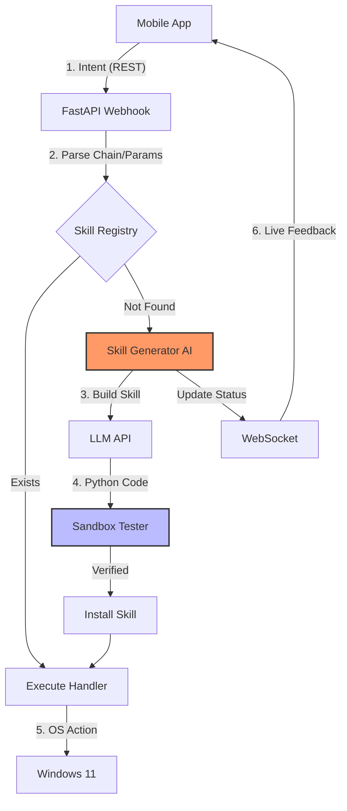

<!-- 
FILE_TYPE: Project Diagram
CATEGORY: System Design
ENTRIES: 1 Diagram (Mermaid)
DATE_RANGE: 2026-05-08
KEYWORDS: Mermaid, Flowchart, Agentic Loop, WebSocket
SUMMARY: Visual representation of the Agentic Skill Loop and command execution flow for the Remote PC Controller.
-->
# System Flow Diagram - Agentic Remote PC Controller

### Flow Highlights:
- **Agentic Loop:** Steps 3-4-5 show how the system builds itself.
- **Feedback:** Step 6 ensures the user isn't left in the dark during the build process.
- **Security:** Sandbox Tester (Step G) acts as the gatekeeper.
